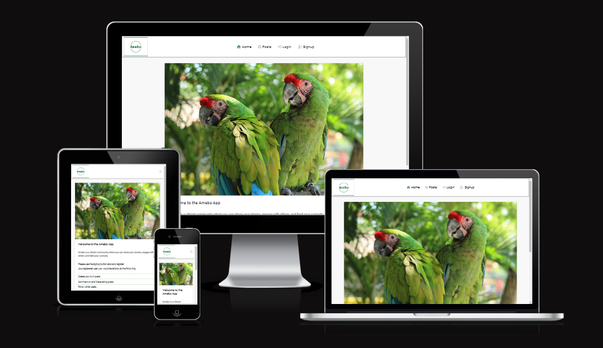

# Amebo

## Project Goals

The Amebo app was designed as a social media platform to share interesting content with other people. It promotes social interaction by giving users the ability to comment on posts, like posts and follow users whose posts they find interesting.

This project utilizes two separate repositories. One for the frontend and another for the backend.

The frontend is designed using the [React](https://react.dev/) Library.

The backend utilizes [Django Rest Framework](https://www.django-rest-framework.org/) and the repository for this can be found [here](https://github.com/sategie/amebo_drf) 

## Agile Methodology

An agile approach was adopted in designing this project.

The various themes were broken down into Epics which were in turn broken down into a total of 25 User Stories.

These User Stories were then broken down into 6 iterations for planning purposes.

The User Stories were completed in order of importance, with the features needed for a MVP(minimum viable product) completed first.

The Kanban Board showing the overall planning for the User Stories can be found in the screenshots below:

(Screenshots of Iterations here)

## Project Planning

The project planning utilized the five basic concepts of UX design: Strategy, Scope, Structure, Skeleton and Surface.

### Strategy
This project is aimed at providing a platform to share interesting content and interact with other users. 

The name **Amebo** is a term in Nigerian 'pidgin English' meaning 'to gossip'.

A parrot was used as the landing page image to accurately describe the main idea behind the app.

### Scope
The scope of the project has to do with the requirements, specifications and features.

The major features in the project are:

- Signup: Users have the ability to click the Signup button to create an account.
- Login: Users who already have an account can click the Login button in order to access more features in the app.
- View Posts: All users (irrespective of logged-in status) can view posts from users.
- Create/Edit Posts: Logged in users have the ability to create new posts and edit their existing posts.
- Comment/Edit Comments: Logged in users have the ability to comment on posts and edit comments they created.
- Follow/Unfollow Users: Logged in users have the ability to follow and unfollow users whose post(s) they find interesting.
- View/Edit Profile: Logged in users can view the profile of others and also view/edit their own profiles e.g if they want to upload a profile picture.
- Logout: A logged in user has the option to log out if they are done using the app.

### Structure
The structure of the project relates to how the content and functionality are designed to ensure that users can easily navigate the app.

The project is designed such that when a user logs in for the first time, they see the home (landing) page.
The landing page provides basic information about the app .i.e informing users they need to create an account if they want to access certain features.
After the user logs in, the home page displays what features the user is able to access.

### Skeleton
The skeleton plane shows the wireframes for the project. The wireframes are displayed below:

(Pictures of wireframes here)

### Surface
The surface plane shows the completed app. The wireframes designed for the project were used to create the final app.

The color structure of the project is a mixture of shades of green and black. For some of the buttons, there are also shades of gray and blue.
The major factor considered when choosing the color combinations was readability.

The Roboto font was used througout the project to provide a comfortable viewing experience for end users.
The font sizes are also large enough to enable users view the contents of the app.

## Features

### Landing Page
The landing page provides basic information about the app including the functions available for users.
(screenshot of landing page)

### Signup
When a user clicks the **Signup** option, the user is taken to a signup page to enter the username and password information.

If the user clicks the Signup button without entering the fields, a prompt appears informing that the fields should not be blank.
After filling the fields and clicking on Signup, the user is returned to the landing page with a message welcoming the specific user and providing an overview of features the user has access to.
(screenshot of signup page)

### Login
When a user clicks the **Login** button, the user is prompted to enter the username and password. If the user attempts to click the login button without entering the username and password fields, they are prompted that the felds should not be blank.
After logging in, the user is returned to the landing page with a message welcoming the specific user and providing an overview of features the user has access to.
(screenshot of login page)

### Posts
The posts page lists all the posts created by users. It includes a search bar to filter for posts and users. 

When an unauthenticated user clicks on a particular post, the user can see all the comments associated with the post as well as the number of post likes.
When an authenticated user clicks on a particular post, the user has the option to create a comment or like the post.

(screenshot of Posts Page)

### Create Post
When a user logs into the app, the user is able to click on **Create Post** in order to create a new post

The Create Post form has the option for a title and description as well as an image upload option.
Attempting to create a post without the title and description fields filled out, displays a prompt informing the user that the fields have to be filled.

The user has a **Create** and **Cancel** button in the Create Post form. 
If the user clicks on the create option after filling in the title and description, a new new post is created.
If the user clicks on the cancel button, the user is taken back to the previous page they were on.

(screenshot of Create Post form)

### Edit/Delete Post
A user has the option to edit or delete a post which they created.

To edit/delete a post, the user needs to log in and select the particular post. Afterwards, they need to click the three dots on the right beside the post in order to have the option to edit or delete the post.

If a user chooses to edit the post, a form is opened with the current post content pre-filled. The user then has the option to update the title, description and/or uploaded image accordingly.
The user needs to click on the **Update** button after making the necessary changes, in order to save the new changes.

If a user decides not to continue with the editing, the user can click the **Cancel** button in order to go back to the original post.

(screenshot of Edit/Delete Post form)

### Create/Edit/Delete Comment
A logged in user has the option to add a comment on a post, edit a comment posted or delete the comment.

The user needs to click on the three dots beside the comment in order to have the option to edit or delete the comment.

(screenshot of Create/Edit/Delete comment)

### View Other Profiles

A user can click on another user to view the profile of the user.

The following information appear when a user is selected: profile avatar, username, number of posts, followers and users the profile is following.

### View/Edit Own Profile

A logged in user has the option to select the profile section in the navbar and view and edit their own profile.

The user can edit their own profile by clicking the three dots on the right.

After clicking the three dots, the user is presented with three options: **Change Picture**, **Change Username** and **Change Password**.

Clicking on **Change Picture** enables the user update their profile picture.

Clicking on **Change Username** enables the user update their username.

Clicking on **Change Password** enables the user update their password.

If the user decides not to continue with the editing, the user can click the **Cancel** button to return back to the profile view.

(screenshot of View/Edit profile)

### Follow/Unfollow Users

A logged in user has the option to follow and unfollow other users from any page where the user profile is selectable.

Following a user increases the following count of the logged in user by one. It also simultaneouly increases the followers count of the followed user by one.
Unfollowing a user decreases the following count of the logged in user by one. It also simultaneously decreases the followers count of the followed user by one.

### Followed Users

A logged in user has the option to select **Followed Users** in order to view the profiles of users they are currently following.

The user has the option to unfollow the user on this page.
If the **unfollow** button is selected, the user is removed from the Followed Users page immediately.

(screenshot of Followed Users page)

### Logout

Finally, a logged in user has the option to click on the **Logout** button in order to log out of the app.

Logging out of the app returns the user to the landing page.

## Features Left to Implement/Improve

### Notifications

There is a notifications page in the app. However, clicking on this shows a message to the user informing that the feature is under construction. When this feature is implemented in the project, the notifications for new followers, comments and likes will appear here.

### App Search Bar

The current search bar in the posts page only finds post related content .i.e users who have created a post, post title etc.

I plan to add a search bar in the app navigation menu which would be used to search for all users (irrespective of whether they have created a post or not).

### Infinite Scrolling

Infinite Scrolling is already set up in the app. However, this is only used in the posts section when viewing posts.

I plan to extend this feature to Comments page, Followed Users page as well as the Notifications page (when this has been implemented).

### Frameworks, Libraries and Dependencies

### React

[React](https://react.dev/) is the library used in creating this project

### React-Router-DOM

[react-router-dom](https://www.npmjs.com/package/react-router-dom) is used to set up the client side routing for the React project. It also contains some built in hooks which were used at various points in the project.

### ReactDOM

[react-dom](https://reactjs.org/docs/react-dom.html) is used to to handle rendering of components and elements on the web.

### Axios

[Axios](https://www.npmjs.com/package/axios) is used to handle HTTP requests to the Amebo DRF API. It is also used to handle refresh token requests which enables a user to be logged in for up to 24 hours without having to sign in again every 5 minutes.

### React Bootstrap

[React Bootstrap](https://react-bootstrap.github.io/) is used in the project to provide bootstrap styling without needing to write too many custom CSS styles.

## Technologies Used

Aside from the libraries and dependencies used in the project, several other third party apps were used during the course of the project.

### Screenpresso

[Screenpresso](https://www.screenpresso.com/) is used to capture the screenshots of the project.

### AmIResponsive

[AmIResponsive](https://ui.dev/amiresponsive) is used to capture the responsiveness of the app on various screensizes.

### Heroku

[Heroku](https://www.heroku.com/) is used to host the deployed application.

### Google Fonts

[Google Fonts](https://fonts.google.com/) is used to obtain the Roboto font used throughout this project.

### Font Awesome

[Font Awesome](https://fontawesome.com/) is used to display icons in the application.

### Pixabay

[Pixabay](https://pixabay.com/) is used to get most of the pictures used in the application.

### TinyPNG

[TinyPNG](https://tinypng.com/) is used to reduce the sizes of images used in the app.

### CodeAnywhere

[CodeAnywhere](https://codeanywhere.com/) is the cloud IDE used in coding this project.

### Github

[Github](https://github.com/) is used for version control. It tracks and saves the changes made to the application at various points in time.

## Testing

### Manual Testing

| **Test**        | **TEST ACTION**                                                                   | **EXPECTED ACTION**                                                                                                                                                                       | **RESULT** |
|-----------------|-----------------------------------------------------------------------------------|-------------------------------------------------------------------------------------------------------------------------------------------------------------------------------------------|------------|
| Home Page       | Access Home Page as a non-logged in user                                          | The user sees a welcome message, the hero image and app description. The user is encouraged to create an account to have access to more features.                                      | PASS       |
| Home Page       | Access Home Page as a logged in user                                              | The user sees a personalized welcome message, the hero image and app description.                                                                                                         | PASS       |
| Signup          | A new user clicks on Signup in the nav menu                                       | The user is able to enter the username and set up a password in order to signup for an account.                                                                                           | PASS       |
| Signup          | A new user clicks the Signup button without entering the fields                   | The user is informed that the fields should not be blank.                                                                                                                                 | PASS       |
| Login           | A user who already has an account clicks on the Login button                      | The user is logged in and redirected to the Home Page                                                                                                                                     | PASS       |
| View Posts      | Access Posts as a non-logged in user                                              | The user can view posts as well as comments and likes associated with the posts The user is not able to create a comment or like the post.                                             | PASS       |
| View Posts      | Access Posts as a logged in user                                                  | The user is able to view posts, create comments and like the post.                                                                                                                        | PASS       |
| Create Posts    | A logged in user clicks on 'Create Post'                                          | The user sees a form to enter the title, description and upload an image.                                                                                                                 | PASS       |
| Edit Posts      | A user who created a post clicks on the three dots next to their own post detail. | The user sees the edit icon and can click on it to update the post title, content and/or image.                                                                                           | PASS       |
| Delete Posts    | A user who created a post clicks on the three dots next to their own post detail. | The user sees the trashcan icon and can click on it to delete their own post.                                                                                                             | PASS       |
| Create Comments | A logged in user clicks on the comment icon below any post.                       | The post detail opens and the user has the option to enter a comment beneath the post.                                                                                                    | PASS       |
| Edit Comments   | A logged in user clicks on the three dots next to thier own comment.              | The user sees the edit icon and can click on it to update the comment.                                                                                                                    | PASS       |
| Delete Comments | A logged in user clicks on the three dots next to their own comment.              | The user sees the trashcan icon and cna click on it to delete their comment.                                                                                                              | PASS       |
| Followed Users  | A logged in user clicks on the Followed Users page.                               | The user can see all the profiles they are currently following.                                                                                                                           | PASS       |
| Followed Users  | A logged in user unfollows a user from the Followed Users page.                   | The unfollowed user is immediately removed from the Followed Users page.                                                                                                                  | PASS       |
| View Profile    | A logged in user clicks on the Profile menu.                                      | The user can see their own profile: the profile picture, username, the number of posts created,  number of followers(followers) and the number of users they are following (following) | PASS       |
| View Profile    | A logged in user clicks on the Following count in their profile.                  | The user is taken directly to the Followed Users page which contains the username and avatar of the user(s) they are following.                                                        | PASS       |
| Edit Profile    | A logged in user clicks on the three dots next to their profile.                  | The user has the following options: Change Picture, Change Username and Change Password.                                                                                                  | PASS       |
| Form Validation | A new user clicks on the Signup button without filling the fields.                | A message appears informing the user that the fields should not be blank.                                                                                                                 | PASS       |
| Form Validation | A user clicks the Login button without filling the fields.                        | A message appears informing the user that the fields should not be blank.                                                                                                                 | PASS       |
| Form Validation | A user enters the wrong username or password while logging in.                    | A message appears informing the user that they cannot be logged in with the provided credentials.                                                                                         | PASS       |
| Form Validation | A user enters the two different passwords while trying to sign up.                | A message appears informing the user that the two passwords field did not match.                                                                                                          | PASS       |
| Form Validation | A logged in user does not enter the title or description while creating a post.   | A message appears informing the user that the fields should not be blank.                                                                                                                 | PASS       |
| Form Validation | A logged in user enters a duplicate post title as one of their previous posts.    | A message appears informing the user that they already have an existing post with the same title.                                                                                         | PASS       |

### Validator Testing

#### W3C CSS validator

No errors were found using the [W3C CSS validator](https://jigsaw.w3.org/css-validator/)

### Known Bugs

All bugs found in the project were resolved. Hence, there are currently no known unresolved bugs.

## Deployment

The following steps were taken to deploy the app in Heroku:

- Log in to Heroku.
- Select 'New' on the top right and click on 'Create new app'.
- Enter a name for the app and select the appropriate region.
- Select 'Create app'.
- Select the 'Deploy' tab at the top.
- Select 'GitHub' from the deployment method options to confirm you wish to deploy using GitHub.
- Locate the 'Connect to GitHub' section and use the search box to locate your repo.
- Select 'Connect' afterwards
- OPTIONAL: Choose the main branch under 'Automatic Deploys' and select 'Enable Automatic Deploys' if you wish for your deployed site to be automatically redeployed every time you push changes to GitHub.
- Find the 'Manual Deploy' section, choose 'main' as the branch to deploy and select 'Deploy Branch'.

When deployment is complete, a link to your deployed site will appear.

### How to Fork the Repository

- You can make a copy of the project by doing the following:

    1. Go to the project's Github repository: [Amebo](https://github.com/sategie/amebo)

    2. Click on the *Fork* button on the top right of the screen.

- Note: Changes made here do not affect the original repository

### How to Clone the Repository

- The repository can be cloned by doing the following:

    1. Go to the project's Github repository: [Amebo](https://github.com/sategie/amebo)

    2. Click the green *Code* button on the right.

    3. Click on *HTTPS* and copy the link.

    4. Open Git and change the working directory to where you want to have the cloned directory.

    5. Type *git clone* and paste the copied URL.

- You can make changes to the project by doing the following:

    1. Type *git add .*

    2. Type *git commit -m* and add a short comment within quotes .e.g git commit -m "This is a short comment example"

    3. Type *git push* to push the changes to the repository

- Note: Any update committed to the main branch immediately reflects in the hosted site.

## Credits

### Code

- Code for the ProfileDataContext and ActiveUserContext were adapted from Code Institute's 'Moments' React walkthrough lessons

- The overall inspiration for the project was also drawn from the 'Moments' walkthrough.

### Acknowledgements

- This was a huge project and I could never have completed it without the support of my family.

- Big mentions also go to the tutors at Code Institute for taking their time to assist in debugging some issues I encountered during the course of the project.

- Finally, I want to thank my mentor Jubril Akolade for his useful insights and tips which helped me along the way.

